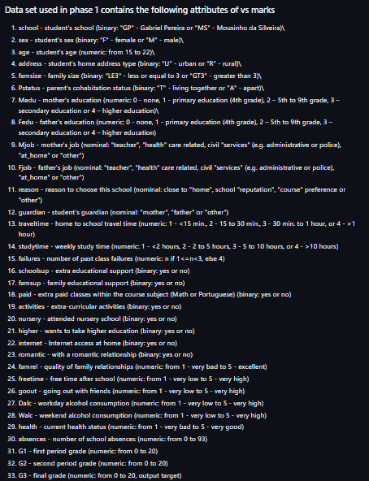

# Quantum_Inpired_PSO_Classifcation

## Phase 1:
*Classify if the students G3 tests are greater than 10 (pass/fail)*

 

See the dataset attributes 

 

### Observations made of the data
Based on the graphs in the `datavisulation.py` file the following observations were made
1. failures > 3 `->` fail
2. Higher==no `->` fail
3. Dalc ==  4 || 5 `->` fail
4. absences >25 `->` fail
5. G1 >= 14 `->` pass
6. G2 >=14 `->` pass